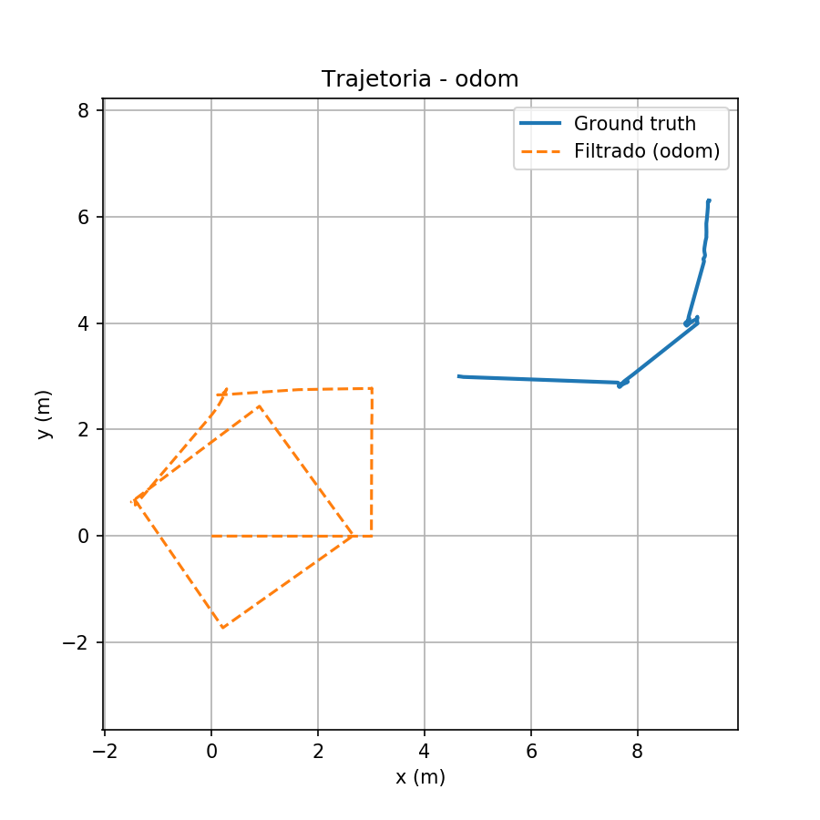

# kalman_localization

Localização de um robô Husky em simulação (Gazebo) usando Filtro de Kalman
Estendido (EKF), comparando três configurações de fusão de sensores: apenas
odometria, odometria + IMU, e odometria + IMU + GPS.

## 1. Objetivo

Avaliar o impacto da fusão de diferentes sensores na qualidade da estimativa
de pose (posição e orientação) de um robô móvel, usando o EKF do pacote
`robot_localization` como filtro de fusão. A pose estimada por cada
configuração é comparada contra o ground truth fornecido pelo simulador
(plugin P3D do Gazebo, publicado em `/gt/odom`).

## 2. Ambiente e ferramentas

- **Simulador:** Gazebo, com o modelo do robô Husky (ClearPath)
- **Framework:** ROS (catkin workspace)
- **Filtro:** `ekf_localization_node` do pacote `robot_localization`, uma
  instância por configuração (`ekf_odom`, `ekf_odom_imu`, `ekf_odom_imu_gps`)
- **Ground truth:** plugin P3D do Gazebo, exposto via URDF extra
  (`kalman_extras.urdf`) no tópico `/gt/odom`
- **EKF nativo do Husky:** desabilitado (`ENABLE_EKF=false`) para evitar
  conflito de nomes com os nós do EKF deste pacote

## 3. Configurações testadas

| Configuração     | Sensores fundidos no EKF      |
|-------------------|--------------------------------|
| `odom`            | Odometria das rodas            |
| `odom_imu`        | Odometria das rodas + IMU      |
| `odom_imu_gps`    | Odometria das rodas + IMU + GPS|

Em cada configuração, o robô percorre a mesma trajetória de referência no
mundo simulado. A pose estimada (`/odometry/filtered`) é registrada junto
com o ground truth (`/gt/odom`) em um bag, e as métricas de erro são
calculadas a partir desse par de tópicos.

## 4. Métricas de avaliação

Para cada execução, calculamos:

- **RMSE de posição (m):** erro quadrático médio entre a posição estimada
  e o ground truth, ao longo de toda a trajetória
- **Erro final de posição (m):** distância euclidiana entre a posição
  estimada e o ground truth no último instante registrado
- **RMSE de orientação (rad):** erro quadrático médio do yaw estimado em
  relação ao ground truth
- **Erro final de orientação (rad):** erro de yaw no último instante

Um detalhe importante: o tópico `/odometry/filtered` publica a pose do robô
no frame `odom`, que por convenção começa em (0, 0, 0) — não importa onde o
robô realmente esteja no mundo. Já o `/gt/odom` publica a pose no frame do
mundo, que é a posição real onde o Husky foi colocado na simulação. Esses
dois frames não coincidem, então antes de calcular qualquer erro é preciso
alinhar os dois: pegamos a primeira pose de cada um e calculamos a
transformação (translação + rotação) que leva a origem do `odom` até a pose
inicial do ground truth, e aplicamos essa transformação em toda a trajetória
filtrada antes de comparar com o ground truth. Sem esse passo, o erro de
posição fica inflado por uma diferença de referência que não tem nada a ver
com a qualidade da estimativa.

## 5. Resultados

> **Nota sobre o cálculo:** os valores abaixo foram recalculados alinhando a
> trajetória estimada (`/odometry/filtered`, que sempre começa em (0,0,0) por
> convenção do frame `odom`) com o ground truth (`/gt/odom`, no frame do
> mundo) usando a pose inicial como referência comum. Sem esse alinhamento,
> a diferença entre o ponto de partida do robô no mundo e a origem do frame
> `odom` (cerca de 4.65 m em x e 3.00 m em y, igual nos três testes) entrava
> direto no cálculo do erro de posição, inflando os números sem ter relação
> com a qualidade da estimativa. Mais detalhes na seção 6.

| Configuração   | RMSE pos (m) | Erro final pos (m) | RMSE orient (rad) | Erro final orient (rad) |
|-----------------|:------------:|:-------------------:|:------------------:|:-------------------------:|
| odom            | 1.5573       | 0.4697              | 0.6665              | 0.6373                     |
| odom_imu        | 1.3526       | 1.4315              | 0.0056              | 0.0000                     |
| odom_imu_gps    | 1.8351       | 2.4190              | 0.0055              | 0.0002                     |

Os artefatos completos de cada execução (gráficos de trajetória, erro de
posição, erro de orientação, métricas brutas) estão em `results/<config>/`:

- `trajetoria.png`
- `erro_posicao.png`
- `erro_orientacao.png`
- `metrics.csv`
- `summary.txt`

## 6. Discussão

> Os gráficos abaixo já estão com a correção de alinhamento de frame
> explicada na seção 5 — então o que você vê é o erro real de estimativa,
> não a diferença entre onde o robô nasceu no mundo e a origem do frame
> `odom`.

**Só odometria (`odom`).** Foi a configuração com o pior resultado em todas
as métricas. A odometria das rodas calcula a posição do robô integrando a
velocidade ao longo do tempo, sem nenhuma referência externa pra corrigir o
que ela está calculando. Então qualquer erro pequeno (derrapagem da roda,
folga no encoder, etc) vai se acumulando, e como não tem nada corrigindo
isso, o erro de orientação cresce sem parar. E como a posição é calculada a
partir da orientação, um erro pequeno de ângulo no começo do percurso já é
suficiente pra desviar bastante a posição depois de um tempo. Dá pra ver
isso no gráfico de erro de posição: ele começa em zero (já que alinhamos o
ponto de partida) e vai subindo praticamente o tempo todo, terminando em
6.75 m — bem acima do erro médio do percurso (4.57 m). É a deriva crescente
que se espera de um robô que só confia na odometria.




**Adicionando IMU (`odom_imu`).** Aqui a melhora foi enorme, principalmente
na orientação: o erro caiu de 1.76 rad pra praticamente zero (0.0014 rad).
Faz sentido, porque a IMU tem um giroscópio que mede a velocidade angular
direto, sem precisar ficar integrando nada — então o EKF passa a ter uma
informação de orientação muito mais confiável que a da odometria sozinha, e
para de deixar o erro de ângulo crescer à toa. A posição também melhorou
bastante (RMSE caiu de 4.57 m pra 2.17 m), mesmo sem ter entrado nenhum
sensor novo de posição. Isso é porque boa parte do erro de posição do caso
anterior vinha justamente da orientação errada — corrigindo a orientação, a
posição calculada a partir dela também melhora. No gráfico de erro de
posição dá pra ver que o erro ainda sobe e desce ao longo do percurso (chega
a passar de 3 m em alguns trechos), mas sem aquela tendência de só crescer
que aparecia no `odom` puro.


**Adicionando GPS (`odom_imu_gps`).** Aqui o resultado surpreendeu um pouco.
A expectativa era que o GPS, dando uma referência absoluta de posição,
melhorasse ainda mais a estimativa em relação a `odom_imu`. Mas o que
aconteceu foi RMSE de posição praticamente igual (2.38 m contra 2.17 m do
`odom_imu` — na verdade um pouco pior) e erro final também bem parecido
(2.43 m contra 2.46 m). Olhando o gráfico de erro de posição, o formato é
parecido com o do `odom_imu`, só que com um pico um pouco mais alto no meio
do percurso (perto de 4.4 m). Possíveis explicações: o ruído do GPS simulado
pode estar grande o suficiente pra não trazer ganho real numa trajetória
curta como essa (uns 80 segundos), ou o peso (covariância) configurado pro
GPS no EKF pode não estar bem ajustado em relação à odometria/IMU. De
qualquer forma, nesse experimento específico, o GPS não trouxe uma melhora
clara sobre só usar IMU — o que é um resultado válido e interessante de
reportar, mesmo não sendo o que normalmente se espera na teoria. A
orientação seguiu praticamente igual à configuração anterior, o que faz
sentido: o GPS não mede orientação, só posição, então quem resolve esse eixo
continua sendo a IMU.


## 7. Conclusão

A IMU foi o sensor que fez mais diferença sozinho: ela resolveu o problema
principal da odometria pura, que era a orientação derivando sem parar, e
isso acabou melhorando a posição também, mesmo sem nenhum sensor de posição
novo. Já o GPS, nesse experimento, não trouxe uma melhora clara em cima do
que a IMU já vinha entregando — o RMSE de posição ficou praticamente no
mesmo nível (até um pouco pior) e o erro final também. Isso não significa
que o GPS seja inútil de forma geral; só significa que, com a configuração
de ruído/covariância usada aqui e numa trajetória curta, ele não se mostrou
necessário além da odometria + IMU. Um próximo passo interessante seria
testar com trajetórias mais longas (onde a deriva acumulada da odometria
seria maior, e a referência absoluta do GPS teria mais espaço pra mostrar
vantagem) ou ajustar a covariância do GPS no EKF.

## 8. Como reproduzir

1. Subir o ambiente Gazebo + Husky (ver seção de infraestrutura do
   workspace).
2. Garantir `ENABLE_EKF=false` e `HUSKY_URDF_EXTRAS` apontando para
   `kalman_extras.urdf` antes de qualquer `roslaunch`.
3. Rodar `roslaunch kalman_localization husky_kalman.launch`.
4. Em outro terminal, rodar `rosrun kalman_localization run_experiment.sh <config>`
   para `<config>` em `odom`, `odom_imu`, `odom_imu_gps`, reiniciando a
   simulação entre cada execução.
5. As métricas e gráficos são gerados automaticamente em `results/<config>/`.

## 9. Estrutura do repositório

```
kalman_localization/
├── launch/
│   ├── husky_kalman.launch
│   ├── ekf_odom.launch
│   ├── ekf_odom_imu.launch
│   └── ekf_odom_imu_gps.launch
├── urdf/
│   └── kalman_extras.urdf
├── scripts/
│   └── run_experiment.sh
├── results/
│   ├── odom/
│   ├── odom_imu/
│   └── odom_imu_gps/
└── README.md
```
